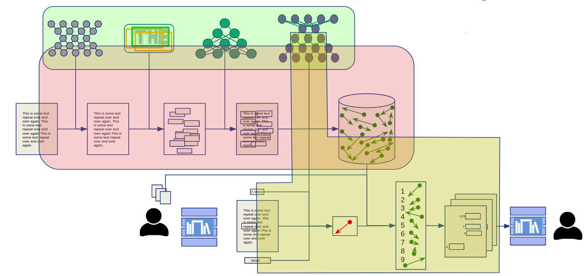

# CB Backend
#### Manuscript text image retrieval

This repository contains a full toolchain with all the tools needed to implement the backend for a large scale text image retrival system.

---------------------------------------------------------------------------------
Software consists of three computation stages:
#### 1. Machine learning
This Module is creates the neural networks needed for computation and adapts them to annotated data. The outcome of this stage is trained pytorch neural networks. 
This stage should re-run everytime there are new annotated data or new training parameters.
#### 2. Offline computation
This stage creates the indexes needed for image retrieval it is computationally expensive and its outcome must be cached on the filesystem. This should be constantly running updating the indexes every time the machine learning models are changed. The outcome of this stage id .pickle files containing all the precomputed indexes.      
#### 3. Online computation
This stage performs the searching in real-time. The outcome is served as a web-service. Queries can be QBE(Query by example), QBS(Query by string), and QBR (Query by reference).
And the answers are a list of relevant locations on pages. The format of references and answers follows the [Porta Fontium](https://www.portafontium.eu/?language=en)

---------------------------------------------------------------------------------

[Funded by:](https://anguelos.github.io/czeck_bavaria/)

[Project page:](https://anguelos.github.io/czeck_bavaria/)